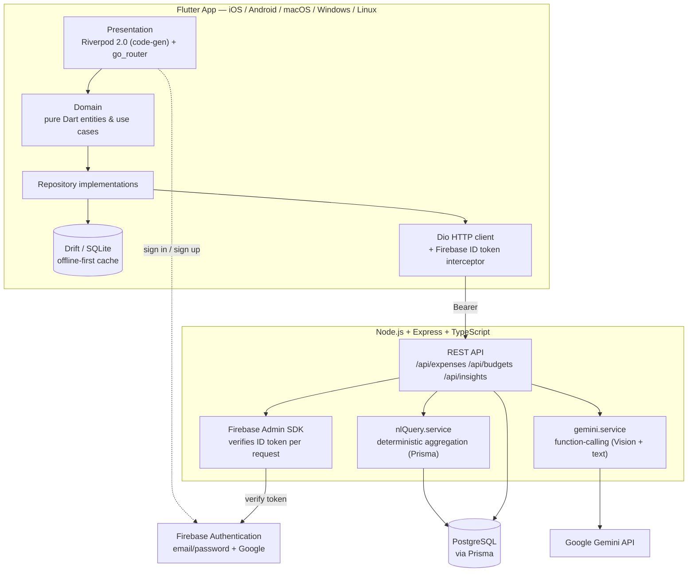

<div align="center">

# 💸 SpendSense

**An AI-powered personal expense tracker.** Photograph a receipt and Gemini Vision extracts the merchant, date, line items, and total. Ask a plain-English question — *"how much did I spend on food last month vs my salary?"* — and get a real, computed answer with a chart. Works offline; syncs when you're back online.

[](.github/workflows/ci.yml)
[](https://flutter.dev)
[](backend)
[](#license)

</div>

---

## Why this exists

Most "expense tracker" side projects stop at CRUD: add a row, show a list. SpendSense is built around the two things that actually make an app feel *AI-powered* rather than *AI-flavored*:

1. **Receipt capture that's actually useful.** Point a camera at a receipt, and Gemini Vision does the data entry for you — merchant, date, line items, total, and a suggested category — via a structured function-calling schema, not a fragile text-scrape. You still confirm before anything is saved, per [Google's own guidance](https://ai.google.dev/gemini-api/docs/function-calling) that consequential function calls should be validated with the user first.
2. **A query bar that can't lie to you about your own money.** The natural-language bar doesn't let an LLM generate SQL or do arithmetic — both are places LLMs are unreliable and where a wrong answer about your finances is actually bad. Instead, Gemini's only job is *classifying intent* (structured, schema-validated function calling: which of six question types, which date range, which categories); every sum, average, and comparison is computed deterministically in TypeScript against Postgres. The result is a pipeline that's fast, cheap, correct, and — critically — unit-testable with the LLM call mocked out.

## Features

| | |
|---|---|
| 📸 **Receipt scanning** | Camera or gallery → Gemini Vision extraction → user-reviewed confirmation screen before it ever touches the database |
| ✍️ **Manual entry** | Full CRUD with category, type (expense/income), notes, and date |
| 💬 **Natural-language insights** | "How much did I spend on transport this month?" → plain-English answer + an auto-picked chart (bar/line/pie) |
| 📊 **Dashboard** | Category breakdown, 6-month trend, income vs. spend, all per-month navigable |
| 🎯 **Budgets** | Per-category monthly limits with over-budget flags |
| 📡 **Offline-first** | Every write lands in a local Drift/SQLite cache instantly; a background sync pushes to the backend and reconciles on reconnect |
| 🔐 **Firebase Auth** | Email/password and Google sign-in |
| 🔒 **Zero client-side secrets** | The Gemini API key never leaves the backend — the app only ever talks to *our* API |

## Architecture



## Tech stack

| Layer | Choice | Why |
|---|---|---|
| Mobile/desktop client | Flutter 3.44, Dart 3.12 | One codebase, five platforms |
| State management | Riverpod 2.0 (`@riverpod` code-gen) | Compile-time-safe DI, no `BuildContext` plumbing |
| Local persistence | Drift over SQLite | Type-safe SQL, reactive streams, real offline support |
| Navigation | go_router | Declarative routes, auth-aware redirects |
| Backend | Node 20, Express, TypeScript | Small, fast, everyone can read it |
| ORM | Prisma + PostgreSQL | Migrations, type-safe queries, `Decimal` for money |
| Auth | Firebase Authentication | Free tier, battle-tested, email + OAuth out of the box |
| AI | Gemini API, function-calling only | Structured, schema-validated output — never free-text SQL |
| Charts | fl_chart | Native-rendered, no WebView |

Both the Flutter **domain layer** and the backend's **`nlQuery.service`** follow the same rule: business logic has zero dependency on Flutter/Riverpod/Express, so it's fast, deterministic, and mockable to unit test.

## Project structure

```
SpendSense/
├── app/                        # Flutter client
│   └── lib/
│       ├── core/                # theme, router, network, shared widgets, env
│       └── features/
│           ├── auth/            # domain / data / presentation
│           ├── expenses/        # capture, manual entry, offline sync
│           └── insights/        # dashboard, NL query, budgets
├── backend/                     # Express + TypeScript + Prisma API
│   ├── src/
│   │   ├── routes/ controllers/ services/
│   │   ├── middleware/          # auth, rate limiting, error handling
│   │   └── lib/                 # Prisma client, Firebase Admin
│   ├── prisma/schema.prisma
│   └── test/                    # Jest, LLM calls mocked
├── docker-compose.yml            # local Postgres
└── .github/workflows/ci.yml
```

## Prerequisites

- [Flutter SDK](https://docs.flutter.dev/get-started/install) 3.44+ (built against 3.44.6)
- [Node.js](https://nodejs.org) 20+
- [Docker](https://www.docker.com/) (for local Postgres) — or any local Postgres 14+ instance
- A [Firebase](https://console.firebase.google.com) project with Authentication enabled (see below)
- A free-tier [Gemini API key](https://aistudio.google.com/app/apikey)

## Setup

### 1. Firebase Authentication (one manual step)

This repo already has a Firebase project wired up (`xenon-world-502717-f0`) with Android, iOS, and Web apps registered, and their config files already in place (`app/lib/firebase_options.dart`, `app/android/app/google-services.json`, `app/ios/Runner/GoogleService-Info.plist`, `app/macos/Runner/GoogleService-Info.plist`).

**One thing can't be automated:** Google gates a brand-new project's *first* Authentication setup behind the console UI — there's no public API for it. Do this once:

1. Open [Firebase Console → Authentication](https://console.firebase.google.com/project/xenon-world-502717-f0/authentication) → **Get started**.
2. Enable the **Email/Password** provider.
3. Enable the **Google** provider (pick a support email when prompted).
4. For Android Google Sign-In to work on a real device, add your debug keystore's SHA-1 under Project settings → your Android app → Add fingerprint (`./gradlew signingReport` from `app/android` gives you this once you have Android Studio installed).

### 2. Backend

```bash
cd backend
cp .env.example .env      # fill in GEMINI_API_KEY
npm install

# from the repo root
docker compose up -d

cd backend
npx prisma migrate deploy
npm run dev
```

The backend listens on `http://localhost:4000`. `GET /health` should return `{"status":"ok"}`.

> This machine already runs a native Postgres on port 5432, so `docker-compose.yml` maps the container to host port **5433** instead. If you're on a clean machine, feel free to change both back to 5432.

### 3. Flutter app

```bash
cd app
cp .env.example .env      # BACKEND_BASE_URL — defaults to localhost:4000
flutter pub get
dart run build_runner build --delete-conflicting-outputs   # generates Riverpod + Drift code
flutter run -d chrome     # or: macos, ios, android, windows, linux
```

On the **Android emulator**, set `BACKEND_BASE_URL=http://10.0.2.2:4000` in `app/.env` (the emulator's alias for your host machine) instead of `localhost`.

Web runs the offline cache on SQLite compiled to WebAssembly (`web/sqlite3.wasm` + `web/drift_worker.js`, via [`drift_flutter`](https://pub.dev/packages/drift_flutter)) — same Drift code, same offline-first behavior, no separate code path to maintain.

## Using it

1. Launch the app → **Sign up** with email/password (or Google, once the console step above is done).
2. **Dashboard** — category breakdown, 6-month trend, and the query bar at the top.
3. **Expenses tab** → **+** → fill in a manual expense, or tap **Scan receipt** from there to try the camera/gallery flow.
4. Ask the query bar things like *"how much did I spend on food last month?"*, *"compare my spending across categories this month"*, or *"how much did I spend vs my salary?"*.
5. **Budgets tab** → set a monthly limit per category; the dashboard flags anything over.

## Testing

```bash
# Flutter — domain use cases (mocked repositories) + widget tests
cd app && flutter test

# Backend — nlQuery.service and gemini.service with the LLM call mocked out
cd backend && npm test
```

Both suites run without any live network calls or a real database — Prisma and the Gemini SDK are mocked in the backend tests; repositories are mocked in the Flutter domain tests. CI (`.github/workflows/ci.yml`) runs `flutter analyze`, `flutter test`, and the backend's typecheck + Jest suite on every push.

## API keys you need to provide

| Key | Where | Get it from |
|---|---|---|
| `GEMINI_API_KEY` | `backend/.env` | [aistudio.google.com/app/apikey](https://aistudio.google.com/app/apikey) — free tier |

Everything else (Firebase config, the backend's service account) is already generated and either committed to non-secret files or sitting in `backend/secrets/` (git-ignored).

## Known limitations

- **Google Sign-In needs the manual Firebase console step** described above, plus a registered SHA-1 for Android — this can't be done from a script since it depends on a signing keystore. Until then, tapping "Continue with Google" fails gracefully with an error message rather than crashing the app (it used to crash the whole app on web specifically, since `GoogleSignIn()` was constructed eagerly at boot instead of lazily on first use — fixed).
- **Sync conflict resolution is last-write-wins**, not a full CRDT/merge strategy. Fine for a single-user app used from one device at a time; editing the same expense concurrently from two offline devices would let the later sync win.
- **The natural-language query bar is intentionally narrow**: it classifies one of six intents (category total, overall total, trend, compare categories, spend-vs-income, budget-vs-actual) via Gemini function-calling rather than open-ended SQL generation. That's a deliberate security/correctness choice (see [Why this exists](#why-this-exists)), not a bug — but it means genuinely novel question shapes fall back to "try rephrasing it."
- **AI endpoints are rate-limited** (10 requests/minute/user by default, `RATE_LIMIT_AI_PER_MINUTE` in `backend/.env`) to protect the free-tier Gemini quota from runaway client bugs.
- **Currency is USD-only** in the UI formatting; the data model carries a `currency` field per expense so multi-currency support is a schema-compatible follow-up, not a rewrite.

## License

MIT — see [LICENSE](LICENSE).

---

Sources consulted for structure/best-practice decisions in this README and the AI pipeline design:
- [Function calling with the Gemini API](https://ai.google.dev/gemini-api/docs/function-calling) — Google AI for Developers
- [Structured outputs](https://ai.google.dev/gemini-api/docs/structured-output) — Google AI for Developers
- [GitHub README best practices](https://github.com/jehna/readme-best-practices)
